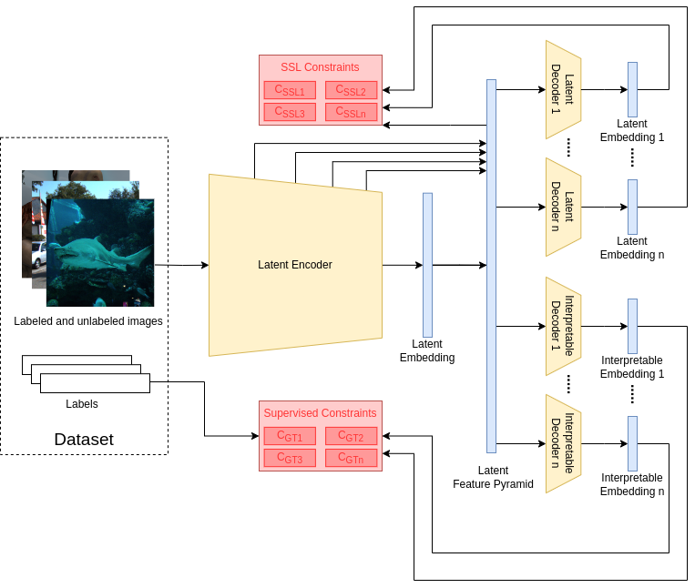

# Multitask Pipeline

This repository contains the source codes of the Multitask Pipeline, which is a framework on top of PyTorch which supports multitask learning workflows. The aim of this work is to create a framework that can seamlessly integrate modular components into a multitask workflow to constraint a single encoder.

## Overview

    SSL Pipeline. Depicts the general data-flow in through the pipeline.

Software architecture of a typical pipeline consists of the above structure. 1. Data is fed into a latent encoder, which will extract a feature pyramid. This is the shared encoder that the pipeline attempts to learn. 2. The extracted features are then passed through latent and interpretable decoders. Which produces latent and interpretable logits. 3. These logits are then used to calculate multiple losses.

</align>

## Acknowledgements

This work is still under development and used in some of our projects. Feel free to collaborate 😃.
Checkpoints file to load states from
